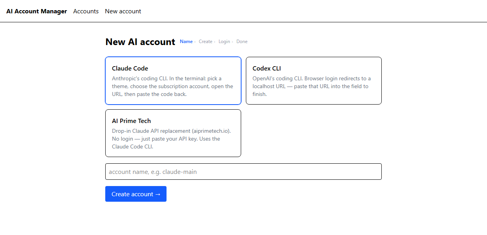

# AI Account Manager

A Portainer-style web app for managing **isolated AI CLI accounts inside Docker
containers**. Each account runs in its own hardened container with its own
persistent auth and workspace volumes. Create accounts, run guided logins,
open interactive terminals, and track per-day usage — all from one UI.

Supports three providers:

| Provider | CLI | Auth | Runner image |
|---|---|---|---|
| **Claude Code** | `@anthropic-ai/claude-code` | claude.ai OAuth (paste-back code) | `ai-runner-claude` |
| **Codex CLI** | `@openai/codex` | browser login + localhost callback | `ai-runner-codex` |
| **AI Prime Tech** | Claude Code (drop-in) | API key (env vars) | `ai-runner-claude` |
| **Grok Build** | `@xai-official/grok` | device code (confirm in browser) | `ai-runner-grok` |

> One reusable runner image **per provider**; one container + two volumes
> **per account**. Never one image per account.

See [`ARCHITECTURE.md`](./ARCHITECTURE.md) for the full design, security model,
and the rationale behind every major decision.

## Features

- **Guided create wizard** (`/create`): pick a provider, name it, watch a live
  progress bar build the container, then complete login in an embedded terminal.
- **Container lifecycle**: create / start / stop / restart / delete, status, logs.
- **Login flows** per provider: Claude paste-back code, Codex localhost-callback
  forwarding, AI Prime Tech API-key entry. Onboarding prompts (theme, account
  type) are auto-answered where the flow is automated.
- **Interactive terminals** over WebSocket (xterm.js) with a real PTY.
- **Per-day usage dashboard**: usage is captured via the free `/usage` (Claude)
  and `/status` (Codex) slash commands, snapshotted into Postgres, and charted
  by day of the month.

  > **Two refresh rates — don't confuse them.** The accounts page **re-reads and
  > re-renders every 10 s** (a cheap DB read) so the values and the "updated Xs
  > ago" label stay live — but this does **not** capture new data. The actual
  > **usage capture** (which boots the CLI's `/usage`//`/status` panel, ~30 s per
  > account) runs on the backend poller every **`USAGE_POLL_MINUTES`** (default
  > **2 min**), or immediately when you click the **📊 Usage** button. So the
  > numbers change at most every 2 minutes; the 10 s tick only refreshes the
  > display.
- **Credit-safe by design**: nothing automated ever sends a billable prompt.
  Only the free slash commands run on a schedule; message/exec paths are manual
  and clearly marked.
- **Login & users**: multi-user accounts (bcrypt), httpOnly-cookie session
  guarding the UI, REST API, and WebSockets, per-account brute-force lockout,
  and a `/users` management page. Optional TLS via a Caddy proxy.
- **Security-first runners**: non-root, `cap_drop: ALL`, `no-new-privileges`,
  CPU/memory/pid limits, no published ports, no Docker socket, named volumes.
- **No tokens in the database**: provider auth lives only in the per-account
  home volume. The DB stores metadata and redacted audit events.

## Screenshots

### Create wizard

Pick a provider, name the account, and the wizard builds the container and walks
you through login (`Name › Create › Login › Done`).



Other views (not shown here because they display live account data — add your own
scrubbed captures to `docs/screenshots/`):

- **Dashboard** — total/running/authenticated counts and per-day usage charts
  for the current month.
- **Accounts** — cards with provider badge, running/auth chips, live usage bars,
  a "updated Xs ago" label, and lifecycle actions. Auto-refreshes every 10 s.
- **Terminal** — interactive xterm.js session with free `/usage` and `/status`
  buttons and a (credit-flagged) message box.
- **Login modal** — login URL, device/paste-back code, live terminal, and the
  code / localhost-callback input.

## Stack

- **Frontend**: Next.js (App Router) · React · TypeScript · Tailwind CSS · xterm.js
- **Backend**: FastAPI · Docker SDK for Python · SQLModel · WebSockets
- **Database**: PostgreSQL
- **Runtime**: Docker Engine (single host); the `DockerService` seam allows a
  Portainer/multi-host backend later.

## Quick start

Prereqs: Docker Engine (Docker Desktop / WSL2 on Windows), and the runner
images built once.

```bash
# 1. Build the runner images (rebuild after CLI upgrades)
docker build -f docker/claude.Dockerfile -t ai-runner-claude:latest docker/
docker build -f docker/codex.Dockerfile  -t ai-runner-codex:latest  docker/
docker build -f docker/grok.Dockerfile   -t ai-runner-grok:latest   docker/

# 2. Bring up db + backend + frontend
docker compose up --build
#   UI:  http://localhost:3000
#   API: http://localhost:8000/docs
```

Everything binds to `127.0.0.1`. A **login** protects the UI, API, and
WebSockets — multiple users (bcrypt-hashed), an httpOnly cookie session, and
per-account brute-force lockout. The first user is seeded from
`APP_USERNAME` / `APP_PASSWORD` (default `admin` / `admin` — **change it**);
add more in the UI (`/users`). For HTTPS, use the optional TLS proxy (below).

### Configuration

Set in `docker-compose.yml` (backend service):

| Env var | Default | Purpose |
|---|---|---|
| `APP_USERNAME` / `APP_PASSWORD` | `admin` / `admin` | Seeds the **first** user if the table is empty — **change before first run** |
| `APP_SECRET` | random per process | Token signing key. Set it to keep logins valid across restarts; unset means restart logs everyone out |
| `APP_TOKEN_HOURS` | `12` | Login token lifetime |
| `APP_COOKIE_SECURE` | `0` | Set `1` when served over HTTPS (the TLS proxy sets this) |
| `APP_LOGIN_MAX_FAILS` / `APP_LOGIN_LOCK_SECONDS` | `5` / `900` | Brute-force lockout threshold and window |
| `RUNNER_TZ` | `Europe/Madrid` | Timezone the CLIs render usage/reset times in |
| `USAGE_POLL_MINUTES` | `2` | How often the backend re-captures usage (`0` disables). Not the display refresh — the accounts page re-renders every 10 s regardless. |
| `DATABASE_URL` | compose-provided | Postgres connection |

### HTTPS (optional)

A Caddy proxy serves everything from one HTTPS origin (so the cookie is
`Secure` + same-site and there's no CORS):

```bash
docker compose -f docker-compose.yml -f docker-compose.tls.yml --profile tls up --build
# then open https://localhost:8443
```

Caddy's internal CA issues the `localhost` cert, so the browser warns unless you
trust that CA (`caddy trust`) — expected for local TLS. The direct `:3000` / `:8000`
ports still work without this overlay.

## Using it

1. **Create** — go to `/create`, choose a provider, name the account. The wizard
   creates the container and volumes with a progress bar.
2. **Log in**:
   - **Claude**: pick a theme and the subscription account in the terminal, open
     the printed URL, then paste the code back in the field (or the terminal).
   - **Codex**: open the URL, sign in; your browser dead-ends on a `localhost`
     page — paste that full URL into the field to forward it to the CLI.
   - **AI Prime Tech**: paste your `sk-` API key; it's written only to the
     account's home volume (`~/.aiprimetech.env`), never the database.
3. **Verify** — the wizard checks auth via each provider's status command.
4. **Use** — open a terminal (⌨), or watch usage on the dashboard. The **/usage**
   and **/status** buttons are free; sending a message consumes credits and is
   clearly flagged.

## Tests

```bash
cd backend
pip install -r requirements.txt pytest
pytest tests/          # adapters, redaction, callback validation, PTY responders
```

Unit tests mock Docker and need no daemon. Live verification uses the real
containers once the runner images are built.

## Repository layout

```
backend/      FastAPI app (adapters, docker_service, pty_manager, auth_flow, …)
frontend/     Next.js app (create wizard, accounts, terminal, dashboard)
docker/       claude.Dockerfile, codex.Dockerfile (runner images)
db/           001_init.sql (Postgres schema)
docker-compose.yml
ARCHITECTURE.md
```

## Security & limitations (read before deploying)

- Login guards the UI/API/WS: multi-user (bcrypt), httpOnly-cookie session
  (12 h default), per-account lockout after repeated failures. Enable HTTPS
  with the TLS proxy before exposing beyond localhost.
- Docker-daemon access is root-equivalent; the backend container holds the
  socket and must be treated accordingly.
- Terminal/usage parsing is intentionally best-effort — CLI updates can change
  output; raw output is always preserved.
- This tool manages accounts a user legitimately owns. It must not be used to
  bypass provider limits, rotate accounts, or automate abuse. Nothing in the
  design facilitates that, and all account actions are audited.

Full risk list and mitigations are in `ARCHITECTURE.md`.

## License

MIT — see [`LICENSE`](./LICENSE).
